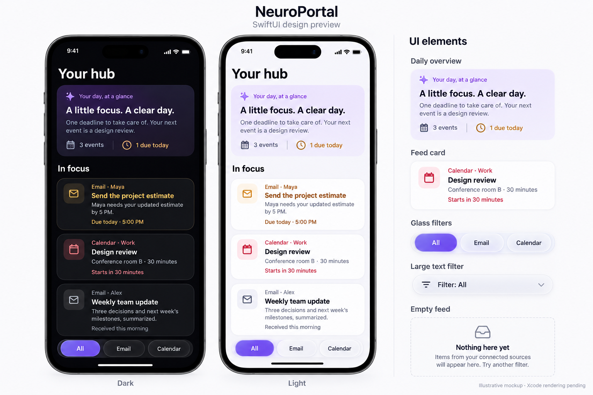

# SwiftUI refinement

The October 9 refinement applies the newly installed SwiftUI Liquid Glass,
SwiftUI Expert, SwiftUI UI Patterns, and Mobile iOS Design skills. The original
Figma file has not been updated to match this SwiftUI pass.



This generated mockup illustrates the design; it is not a screenshot of a running
app. Xcode rendering and native glass animations remain unverified.

## Changes

- Existing `HubCard` and `DailyOverviewCard` initializer inputs remain compatible.
  Larger semantic typography, source-symbol insets, more spacing, quiet borders,
  and an overview gradient behind the text improve hierarchy.
- Light mode uses white cards and darker red/amber urgency colors. Semantic
  primary/secondary text follows appearance. Custom caller accents must be
  readable in both appearances. Urgency classification and minute refresh remain unchanged.
- `HubView` supplies a scrolling overview, feed, empty state, and working All,
  Email, and Calendar filters. Feed order remains caller-controlled.
- Native iOS 26 glass button styles provide responsive touch effects, grouped
  within `GlassEffectContainer`. The compact filter menu uses interactive glass.
  Glass stays in the control layer, above opaque content cards.
- iOS 16–25 use bordered controls and system material. Reduce Transparency
  uses opaque surfaces and bordered controls on every OS. Reduce Motion disables
  the custom spring; native glass responds to system accessibility preferences.
  Increased Contrast strengthens card borders.
- Text scales with Dynamic Type. Overview counts stack at accessibility sizes;
  filters become a menu when the row no longer fits. Controls have at least
  44 × 44-point targets and VoiceOver names/selection traits.
- The layout respects safe areas and limits long line lengths at iPad widths.

## Integration

Add `Components/*.swift`, `Models/HubFeedItem.swift`, and `Views/HubView.swift`
to the iOS target. Add `Views/HubViewPreviews.swift` for the preview matrix.
Minimum runtime remains iOS 16. Compiling glass declarations requires Xcode 26
and the iOS 26 SDK or newer, even with an older deployment target.

```swift
NavigationStack {
    HubView(
        overview: DailyOverviewCard(
            title: "A little focus. A clear day.",
            summary: "Your next event is a design review.",
            eventCount: eventCount,
            deadlineCount: deadlineCount
        ),
        items: feedItems
    )
}
```

Map service data to `HubFeedItem` using stable, provider-prefixed IDs. Supply
current overview counts, summaries, and deadline text. Cards are informational.
Authentication, settings screens, source connections, and app-target wiring
remain integration work. This workspace has no Xcode project or executable app.

## Validation

```sh
python Tests/ContrastCheck.py
swiftc Components/FeedUrgency.swift Tests/FeedUrgencyCheck.swift -o /tmp/feed-urgency-check
/tmp/feed-urgency-check
swiftc Models/HubFeedItem.swift Tests/HubFeedCheck.swift -o /tmp/hub-feed-check
/tmp/hub-feed-check
```

The Python check reads the actual palette and checks brand/urgency text contrast
against card backgrounds and the strongest overview gradient point. It does not
measure rendered glass or system secondary text.

Previews cover dark, light, narrow accessibility text, increased contrast with
reduced transparency/motion, iPad width, and an empty feed. In Xcode, build for
iOS 16 and iOS 26+, render previews, switch all filters, and check VoiceOver,
large text, rotation, and the final card above the filter bar. Inspect native
glass touch effects on a device.

Windows validation covers the source diff and numeric palette contrast only.
Swift compilation, preview rendering, glass behavior, and VoiceOver remain
unverified here. These changes are not a certification of HIG compliance.

References: [Apple UI Design Tips](https://developer.apple.com/design/tips/),
[Designing for iOS](https://developer.apple.com/design/human-interface-guidelines/designing-for-ios),
[Meet Liquid Glass](https://developer.apple.com/videos/play/wwdc2025/219/),
[Applying Liquid Glass to custom views](https://developer.apple.com/documentation/swiftui/applying-liquid-glass-to-custom-views).
